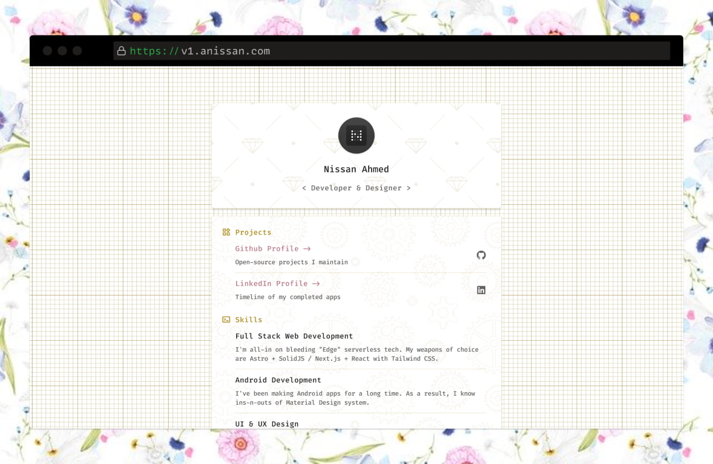

# Portfolio v1

<div align="center"></div>
<br />

> I made this portfolio a long time ago, when I was just an Android developer.
> I saw this cool vanilla HTML/CSS template, and decided to modify it to my own color and design.
> The final design turned out to be a bit classic, and I think it holds up to this day.
>
> I'm currently working on my next personal landing site using Astro + Tailwind CSS.
> As a warm-up, I thought I would migrate the current one first, then build the new one on top of it.
> But I ended up rewriting the whole thing, and it turned out to be a lot of fun as it reminded me how web development has changed over the years.

## Build

First follow the [Astro](https://docs.astro.build/en/getting-started) guideline to setup the dev environment.
Then rename [.env.example](.env.example) to `.env` and configure the environment variables.

Run the following commands and open [http://localhost:8790](http://localhost:8790)

```sh
npm install
npm run dev
```

Follow the [Astro guide](https://docs.astro.build/en/guides/deploy) for deployment.

## Information

**Author:** [Nissan Ahmed](https://anissan.com) ([@ni554n](https://twitter.com/ni554n))

**Donate:** [PayPal](https://paypal.me/ni554n)

